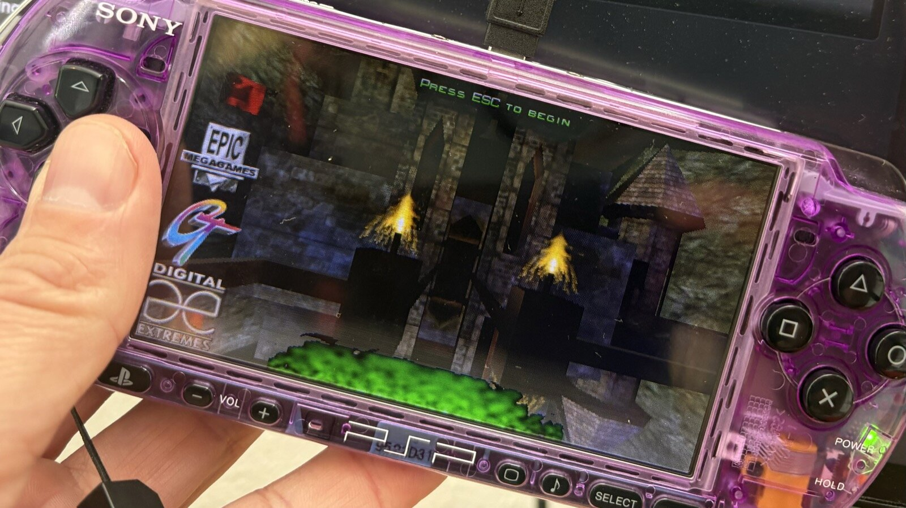

# Unreal (1998) on the PSP



A port of the original *Unreal* to the PSP-2000 and later models: the single-player campaign and the
deathmatch maps, on the console, from a homebrew EBOOT. It is playable and still being worked on.
The first levels run at 20 to 30 fps and have been played through on hardware; the rest of the game
has not, which is where you come in. It is a fork of [fgsfdsfgs/UE1](https://github.com/fgsfdsfgs/UE1);
`DEVELOP.md` has the technical side: what was changed, how to build, how to debug on the console.

## Install

You need a PSP-2000, 3000, Go or Street with custom firmware that runs homebrew (PRO, ME or ARK), a
Memory Stick with 700 MB free, and a computer to run two shell scripts on. A Mac has everything they
use out of the box. On Linux install `curl`, `rsync` and `libarchive-tools` (or `p7zip`). On Windows
use [WSL](https://learn.microsoft.com/windows/wsl/install) with Ubuntu, install the same three
packages there, and the stick shows up as `/mnt/<drive letter>/PSP/GAME`.

```
git clone https://github.com/barttenbrinke/UE1.git && cd UE1
./fetch-assets.sh                                # downloads the game data (~780 MB), asks you to accept Epic's terms
./install-psp.sh /Volumes/<your stick>/PSP/GAME  # copies the EBOOT, the data and the settings to the stick
```

The game data comes from two freely available archives: the Unreal Gold disc image that
[OldUnreal](https://www.oldunreal.com) hosts with Epic Games' permission, and the 1998 Unreal demo
on archive.org. If you own the original 1998 CD, copy its `System`, `Maps`, `Textures`, `Sounds` and
`Music` folders into `GAME_ASSETS/` instead of running the fetch script. `EBOOT.PBP` in the
repository is the current build.

The PSP-1000 is not supported: its 32 MB of RAM are not enough. For PPSSPP, install to
`~/.config/ppsspp/PSP/GAME` and set `MusicME=0` in the `[PSP]` section of that copy's
`System/Unreal.ini`; see `DEVELOP.md` for why.

## Play

Launch **Unreal** from the Game menu of the XMB. The intro flyby starts; press Start for the menu and
start a new game, a deathmatch, or load a save. Saves go to `PSP/GAME/Unreal/Save/` on the stick.
Level loads take 8 to 20 seconds from the Memory Stick.

The PSP has one analog stick and no second one to aim with, so the layout is the one PSP shooters
settled on, and it will feel familiar if you played PlayStation-era games such as *Tomb Raider*
before twin sticks existed: the left hand moves, the right hand turns and looks with the four face
buttons, and the shoulder buttons fire.

| Input | Action |
|---|---|
| Analog stick | move forward and back, strafe left and right |
| Triangle / Cross | look up / look down |
| Square / Circle | turn left / turn right |
| R / L | fire / alternate fire |
| D-pad up / down | jump / crouch |
| D-pad left / right | previous / next weapon |
| Start | menu (also confirms in menus) |
| Select | translator |
| Select + D-pad up | use the selected inventory item (flashlight, jump boots, seeds, health) |
| Select + D-pad left / right | previous / next inventory item |

Unreal has no "use" key: doors, lifts and switches trigger when touched or shot. Select doubles as a
shift key for the inventory because no button was left for it; a quick tap of Select on its own
still opens the translator.

Every binding is an ordinary entry in the `[Engine.Input]` section of `System/Unreal.ini`, so the
layout can be changed with a text editor. `PSP-CONTROLS.txt` has the button numbering, the turn and
look speeds, and a reverse layout where the face buttons move and the stick looks, for those who
prefer it.

## Something is broken

What needs playing most:

* **The single-player campaign, start to finish.** Only the first levels have had real play time on
  hardware. Play as far as you get. Note where the frame rate drops badly, where a level fails to
  load, where a sound loops or is missing, and where anything looks wrong.
* **Deathmatch against bots.** Start a deathmatch from the menu on any of the `Dm` maps, with a few
  bots. This stresses the mesh pipeline and the mixer in ways the campaign does not.

When something breaks (a crash, a level that will not load, a sound that loops forever, a slideshow),
[open an issue](https://github.com/barttenbrinke/UE1/issues) with:

1. What happened and where (level name, and what you were doing).
2. **The save game.** Save just before the problem if you can, then copy from the stick
   `PSP/GAME/Unreal/Save/Save<slot>.usa` (and any other files in that folder for the same slot; hub
   levels write several) and attach it, zipped. A save is small and lets the problem be replayed
   exactly: the port can load a slot and walk forward automatically while the log is watched over
   PSPLink, so a save that reproduces a bug is worth more than any description.
3. `PSP/GAME/Unreal/System/Unreal.log` from the stick, taken right after the problem (the file is
   rewritten at every launch).
4. Your PSP model and firmware, and which EBOOT you ran (the commit you cloned, or your own build).

Performance observations without a crash are welcome too: the level and spot, and roughly what the
game did (slideshow, hitching, fine). The known limits are listed in `DEVELOP.md`.

## Note

Unreal Engine, Unreal and any related trademarks or copyrights are owned by Epic Games. This
repository is not affiliated with or endorsed by Epic Games. It is based on the v200 source
available elsewhere on the Internet, with assets and third party proprietary libraries removed. Do
not use for commercial purposes.
